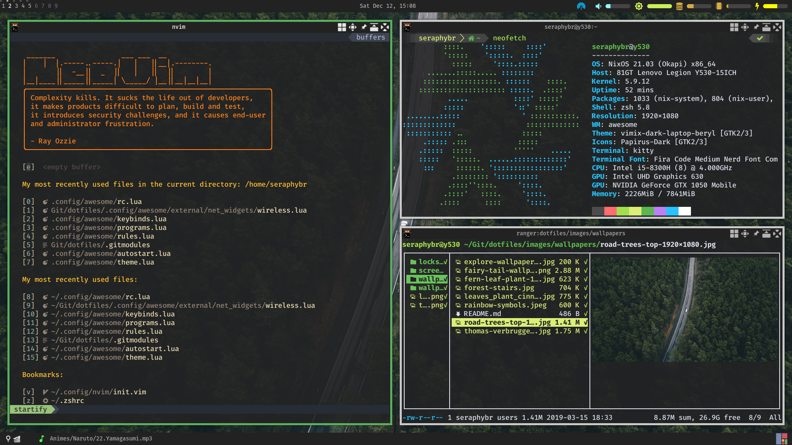
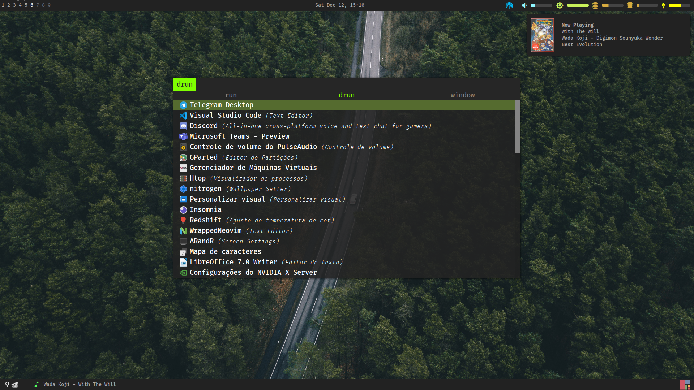
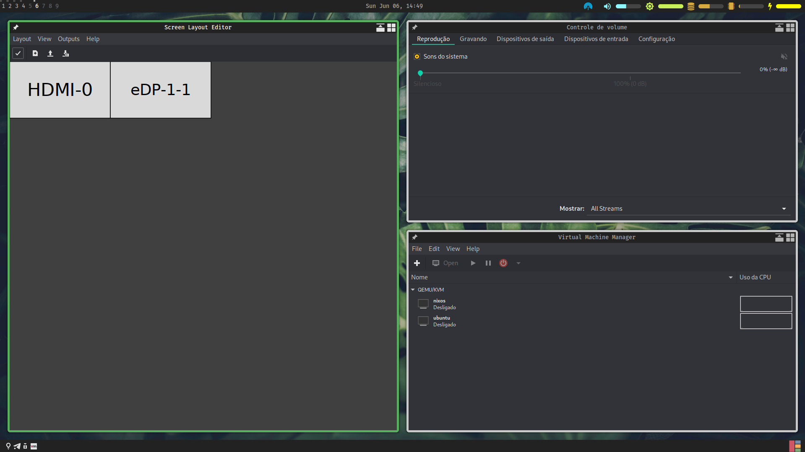
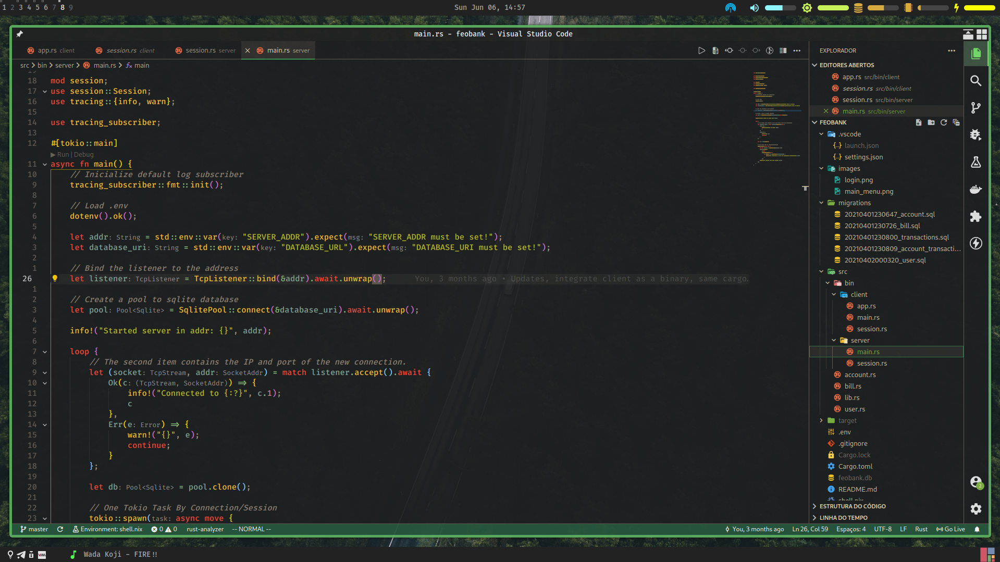

Repository dedicated to my configuration files of my Desktop environment, with the purpose of backup and sharing.

-   [A post on my blog commenting on my dotfiles. (PT-BR) [Old Setup with Bspwm]](https://seraphybr.gitlab.io/DotFiles/)

## Screenshots:

### Rofi:

### GTK/QT Look:

### VSCode Look:

## Setup Description:

| Type              | Program                                                                                                                           |
| :---------------- | :-------------------------------------------------------------------------------------------------------------------------------- |
| Linux Distro      | [NixOS](https://nixos.org/Welcome)                                                                                           |
| Window Manager    | [Awesome](https://github.com/baskerville/bspwm)                                                                                   |
| Compositor        | [Picom](https://github.com/yshui/picom)                                                                                           |
| Web Browser       | [qutebrowser](https://qutebrowser.org/)                                                                                           |
| Program Launcher  | [Rofi](https://github.com/DaveDavenport/rofi)                                                                                     |
| Music Player      | [Ncmpcpp](https://rybczak.net/ncmpcpp/) + [Mpd](https://github.com/MusicPlayerDaemon/MPD)                                         |
| Vídeo Player      | [MPV](https://mpv.io/)                                                                                                            |
| Sound Visualizer  | [Cava](https://github.com/karlstav/cava)                                                                                          |
| File Manager      | [Ranger](https://github.com/ranger/ranger) with [Icons](https://github.com/alexanderjeurissen/ranger_devicons)                    |
| Image Viewer      | [Sxiv](https://github.com/muennich/sxiv) / [ueberzug](https://github.com/seebye/ueberzug) (for preview in Ranger)                 |
| PDF Viewer        | [zathura](https://github.com/pwmt/zathura)                                                                                        |
| Wallpaper Setter  | [hsetroot](https://github.com/himdel/hsetroot)                                                                                    |
| Screenshot tool   | [Shotgun](https://github.com/neXromancers/shotgun) + [Hacksaw](https://github.com/neXromancers/hacksaw)                           |
| Terminal Emulator | [Kitty](https://sw.kovidgoyal.net/kitty/index.html)                                                                               |
| Shell             | Zsh ([Oh-my-zsh](https://github.com/robbyrussell/oh-my-zsh) with [PowerLevel10k](https://github.com/romkatv/powerlevel10k) theme) |
| Text Editor       | [Neovim](https://neovim.io/) / [VScode](https://code.visualstudio.com/)                                                           |
| Lock Screen       | [Betterlockscreen](https://github.com/pavanjadhaw/betterlockscreen) (i3lock-color script)                                         |
| Automounter       | [Udiskie](https://github.com/coldfix/udiskie)                                                                                     |
| GTK theme         | [Vimix-dark-laptop-beryl](https://github.com/vinceliuice/vimix-gtk-themes)                                                        |
| Cursor theme      | Breeze Obsidian                                                                                                                   |
| Icon theme        | [Papirus](https://github.com/PapirusDevelopmentTeam/papirus-icon-theme/)                                                          |

##### Obs: My vscode settings are not present in this repository, they are saved in a private gist, if you are interested, talk to me on the telegram.
