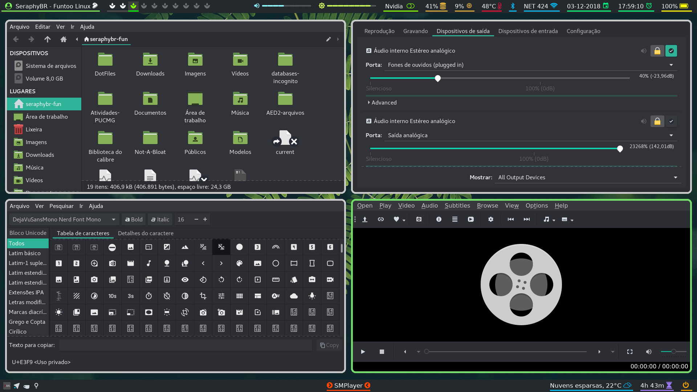

# Dot Files
Repository dedicated to my configuration files of my Desktop environment, with the purpose of backup and sharing.

## Screenshots:


### Rofi:


### Vim:



## Setup Description:
| Type | Program |
|:--- | :---- |
|Linux Distro | [Funtoo](https://www.funtoo.org/Welcome) |
| Window Manager | [Bspwm](https://github.com/baskerville/bspwm) |
| Web Browser | [Firefox](https://www.mozilla.org/pt-BR/firefox/new/) / [qutebrowser](https://qutebrowser.org/) |
| Program Launcher | [Rofi](https://github.com/DaveDavenport/rofi) |
| Status bar | [Polybar](https://github.com/jaagr/polybar) |
| Music Player | [MOC](http://moc.daper.net) and [Spotify](https://www.spotify.com/) (with a polybar module: [spotify_status](https://github.com/Jvanrhijn/polybar-spotify)) |
| Vídeo Player | [SMPlayer](https://www.smplayer.info/) and [MPV](https://mpv.io/) |
| Sound Visualizer | [Cava](https://github.com/karlstav/cava) |
| File Manager  | [Ranger](https://github.com/ranger/ranger) with [Icons](https://github.com/alexanderjeurissen/ranger_devicons) / Thunar |
| Image Viewer | [sxiv](https://github.com/muennich/sxiv) |
| Wallpaper Setter | Nitrogen |
| ScreenShooter | [Flameshot](https://github.com/lupoDharkael/flameshot) |
| Terminal Emulator | [Termite](https://github.com/thestinger/termite) and [Suckless' Simple Terminal](https://gitlab.com/SeraphyBR/st) |
| Shell | Zsh ([Oh-my-zsh](https://github.com/robbyrussell/oh-my-zsh) with [PowerLevel9k](https://github.com/bhilburn/powerlevel9k) theme) |
| Text Editor | [Vim](https://github.com/vim/vim) / [VScode](https://github.com/Microsoft/vscode) |
| Power Manager | [TLP](http://linrunner.de/en/tlp/docs/tlp-linux-advanced-power-management.html) |
| Monitor | Arandr / [xrandr](https://wiki.archlinux.org/index.php/xrandr) |  
| Lock Screen | [Betterlockscreen](https://github.com/pavanjadhaw/betterlockscreen) |
| Notification Daemon | [Dunst](https://github.com/dunst-project/dunst) / libnotify |
| Gtk theme | Adapta-nokto-eta |
| Cursor theme | Breeze Obsidian |

#### Main Fonts used in this Dotfiles:
| Font | Usage |
| :--- | :--- |
| [Cantarell](https://github.com/GNOME/cantarell-fonts) | Gui Programs |
| [DejavuSans](https://github.com/dejavu-fonts/dejavu-fonts) | Terminal (with patched version from Nerd Fonts) & Polybar |
| [Iosevka](https://be5invis.github.io/Iosevka/) | Dunst & VScode |
| [FontAwesome4](https://github.com/FortAwesome/Font-Awesome/tree/fa-4) | Polybar |
| [MaterialDesign](https://github.com/google/material-design-icons) | Polybar |
| [Nerd-fonts](https://github.com/ryanoasis/nerd-fonts) | Zsh |
| [Weather-icons](https://erikflowers.github.io/weather-icons/) | Polybar |

#### Vim Plugins:
| Plugin | Usage |
| :---   | :---  |
| [vim-plug](https://github.com/junegunn/vim-plug) | Plugin manager |
| [vim-startify](https://github.com/mhinz/vim-startify) | Start Screen for Vim |
| [vim-airline](https://github.com/vim-airline/vim-airline) | Status Line |
| [vim-airline-themes](https://github.com/vim-airline/vim-airline-themes) | Themes for vim-airline |
| [indentline](https://github.com/Yggdroot/indentLine) | Display the indention levels with thin vertical lines |
| [ALE](https://github.com/w0rp/ale) | Liting support |
| [vimtex](https://github.com/lervag/vimtex) | LaTeX support | 
| [YouCompleteMe](https://valloric.github.io/YouCompleteMe/) | Code completion |
| [NERDTree](https://github.com/scrooloose/nerdtree) | File explorer
| [nerdtree-git-plugin](https://github.com/Xuyuanp/nerdtree-git-plugin) | Git status support for NERDTree |
| [vim-fugitive](https://github.com/tpope/vim-fugitive) | Git wrapper inside Vim |
| [vim-devicons](https://github.com/ryanoasis/vim-devicons) | Icons for vim plugins |
| [colorizer](https://github.com/chrisbra/Colorizer) | Hex colors Highlight |
| [gruvbox](https://github.com/morhetz/gruvbox) | Colorscheme | 


#### Touchpad Support: 
* To use enable touch-click, install libinput and create the following file in "/etc/X11/xorg.conf.d/30-touchpad.conf"

```  
Section "InputClass"
	Identifier "touchpad"
	Driver "libinput"
	MatchIsTouchpad "on"
	Option "Tapping" "on"
        Option "TappingButtonMap" "lmr"
        Option "TappingDrag" "on"
EndSection 	
```


