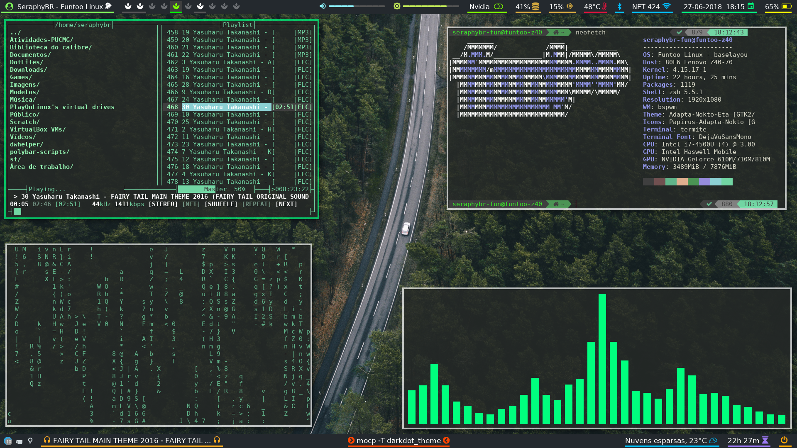

# Dot Files
Repository dedicated to my configuration files of my Desktop environment, with the purpose of backup and sharing.

## Screenshots:



### Rofi:


### GTK/QT Look:


## Setup Description:
| Type | Program |
|:--- | :---- |
| Linux Distro | [Funtoo](https://www.funtoo.org/Welcome) |
| Window Manager | [Bspwm](https://github.com/baskerville/bspwm) (with [Rounded Corners patch](etc/portage/patches/x11-wm/bspwm-0.9.5/rounded.patch))  |
| Web Browser | [qutebrowser](https://qutebrowser.org/) |
| Program Launcher | [Rofi](https://github.com/DaveDavenport/rofi) |
| Status bar | [Polybar](https://github.com/jaagr/polybar) |
| Music Player | [Ncmpcpp](https://rybczak.net/ncmpcpp/) + [Mpd](https://github.com/MusicPlayerDaemon/MPD) |
| Music Player | [Spotify](https://www.spotify.com/) (with a polybar module: [spotify_status](https://github.com/Jvanrhijn/polybar-spotify)) |
| Vídeo Player | [SMPlayer](https://www.smplayer.info/) and [MPV](https://mpv.io/) |
| Sound Visualizer | [Cava](https://github.com/karlstav/cava) |
| File Manager  | [Ranger](https://github.com/ranger/ranger) with [Icons](https://github.com/alexanderjeurissen/ranger_devicons) / Thunar |
| Image Viewer | [sxiv](https://github.com/muennich/sxiv) |
| Wallpaper Setter | [hsetroot](https://github.com/himdel/hsetroot) |
| ScreenShooter | [Flameshot](https://github.com/lupoDharkael/flameshot) |
| Terminal Emulator | [Termite](https://github.com/thestinger/termite) |
| Shell | Zsh ([Oh-my-zsh](https://github.com/robbyrussell/oh-my-zsh) with [PowerLevel9k](https://github.com/bhilburn/powerlevel9k) theme) |
| Text Editor | [Neovim](https://neovim.io/) |
| Power Manager | [TLP](http://linrunner.de/en/tlp/docs/tlp-linux-advanced-power-management.html) |
| Monitor | Arandr / [xrandr](https://wiki.archlinux.org/index.php/xrandr) | 
| Run program as another user | [OpenDoas](https://github.com/Duncaen/OpenDoas) (used in place of sudo) |
| Lock Screen | [Betterlockscreen](https://github.com/pavanjadhaw/betterlockscreen) |
| Notification Daemon | [Dunst](https://github.com/dunst-project/dunst) / libnotify |
| Gtk theme | [Vimix-dark-laptop-beryl](https://github.com/vinceliuice/vimix-gtk-themes) |
| Cursor theme | Breeze Obsidian |

#### Main Fonts used in this Dotfiles:
| Font | Usage |
| :--- | :--- |
| [Cantarell](https://github.com/GNOME/cantarell-fonts) | Gui Programs |
| [DejavuSans](https://github.com/dejavu-fonts/dejavu-fonts) | Terminal (patched version from Nerd Fonts) and Polybar |
| [Iosevka](https://be5invis.github.io/Iosevka/) | Dunst |
| [FontAwesome4](https://github.com/FortAwesome/Font-Awesome/tree/fa-4) | Polybar |
| [MaterialDesign](https://github.com/google/material-design-icons) | Polybar |
| [Nerd-fonts](https://github.com/ryanoasis/nerd-fonts) | Zsh |
| [Weather-icons](https://erikflowers.github.io/weather-icons/) | Polybar |
| [Noto Sans CJK](https://www.google.com/get/noto/help/cjk/) | Polybar (support for Asian letters) |

#### Vim/Neovim Plugins:
| Plugin | Usage |
| :---   | :---  |
| [vim-plug](https://github.com/junegunn/vim-plug) | Plugin manager |
| [gentoo-syntax](https://github.com/gentoo/gentoo-syntax) | Support for specific files related to portage |
| [vim-syntax-extra](https://github.com/justinmk/vim-syntax-extra) | For better C syntax highlighting |
| [vim-startify](https://github.com/mhinz/vim-startify) | Start Screen for Vim |
| [vim-airline](https://github.com/vim-airline/vim-airline) | Status Line |
| [vim-airline-themes](https://github.com/vim-airline/vim-airline-themes) | Themes for vim-airline |
| [indentline](https://github.com/Yggdroot/indentLine) | Display the indention levels with thin vertical lines |
| [auto-pairs](https://github.com/jiangmiao/auto-pairs) | Insert or delete brackets, parens, quotes in pair |
| [undotree](https://github.com/mbbill/undotree) | Undo history visualizer |
| [ALE](https://github.com/w0rp/ale) | Liting support |
| [vimtex](https://github.com/lervag/vimtex) | LaTeX support |
| [LanguageClient-neovim](https://github.com/autozimu/LanguageClient-neovim) | Language Server Protocol support |
| [Deoplete](https://github.com/Shougo/deoplete.nvim) | Code completion |
| [echodoc](https://github.com/Shougo/echodoc.vim) | Print infos in echo area |
| [NERDTree](https://github.com/scrooloose/nerdtree) | File explorer
| [nerdtree-git-plugin](https://github.com/Xuyuanp/nerdtree-git-plugin) | Git status support for NERDTree |
| [vim-nerdtree-syntax-highlight](https://github.com/tiagofumo/vim-nerdtree-syntax-highlight) | Extra syntax and highlight for nerdtree files |
| [vim-fugitive](https://github.com/tpope/vim-fugitive) | Git wrapper inside Vim |
| [vim-devicons](https://github.com/ryanoasis/vim-devicons) | Icons for vim plugins |
| [colorizer](https://github.com/chrisbra/Colorizer) | Hex colors Highlight |
| [markdown-preview](https://github.com/iamcco/markdown-preview.vim) | Markdown Live Preview |
| [gruvbox](https://github.com/morhetz/gruvbox) | Color scheme | 

#### Rofi Theme:
* To use my theme for Rofi, download one of the .rasi files from [here](Rofi/Themes) and run the command:

``` 
sudo cp theme-name.rasi /usr/share/rofi/themes/theme-name.rasi  
```
* And then run the `rofi-theme-selector` command to set the theme to be used.

* My current theme is based on [flat-orange](https://github.com/DaveDavenport/rofi-themes/blob/master/User%20Themes/flat-orange.rasi).
I found it in the [rofi-themes](https://github.com/DaveDavenport/rofi-themes/tree/master/User%20Themes) repository, 
in that same place you can get other themes and modify them as I did. For more details on setting up an .rasi file, run the `man rofi-theme` command.


#### Linux TTY Console:
* In the folder [etc](etc), I have a file called [tty-colors](etc/tty-colors), this is a configuration file containing my color scheme used in the Console. 
  This color scheme is loaded at the initialization of openrc by calling the [setcolors](https://github.com/SeraphyBR/linux-vt-setcolors) 
  program that will apply colors to all TTY's, overriding the default values. 
  I preferred to use this method of [setcolors](https://github.com/SeraphyBR/linux-vt-setcolors) than using echo.

* To use in funtoo/gentoo openrc: 

``` 
git clone https://github.com/SeraphyBR/linux-vt-setcolors
cd linux-vt-setcolors
sudo make install
```

* After installing, copy the file [tty-colors](etc/tty-colors) or use one of the ones that are in the program's
[example-colors](https://github.com/SeraphyBR/linux-vt-setcolors/tree/master/example-colors) directory, to /etc.

* And then create the following script called "tty-colors.start" in [/etc/local.d/](https://wiki.gentoo.org/wiki//etc/local.d) :

``` sh
#!/bin/sh

PROGRAM=/usr/local/bin/setcolors
COLORS=/etc/tty-colors

if [ -e "$PROGRAM" ] && [ -e $COLORS ]; then
    $PROGRAM $COLORS
fi

```

* And then run the following commands to make the file executable, and loaded by openrc at boot time:

```
sudo chmod +x /etc/local.d/tty-colors.start
sudo rc-update add local default
```

#### Touchpad Support: 
* To use enable touch-click, install libinput and create the following file in "/etc/X11/xorg.conf.d/30-touchpad.conf"

```  
Section "InputClass"
	Identifier "touchpad"
	Driver "libinput"
	MatchIsTouchpad "on"
	Option "Tapping" "on"
        Option "TappingButtonMap" "lmr"
        Option "TappingDrag" "on"
EndSection 	
```


