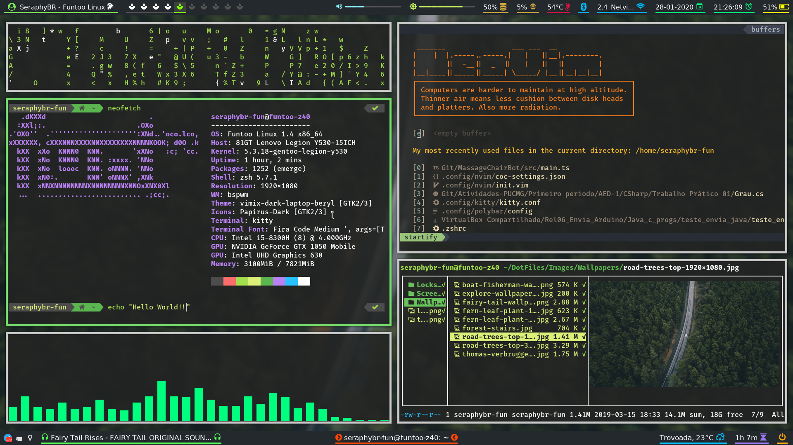
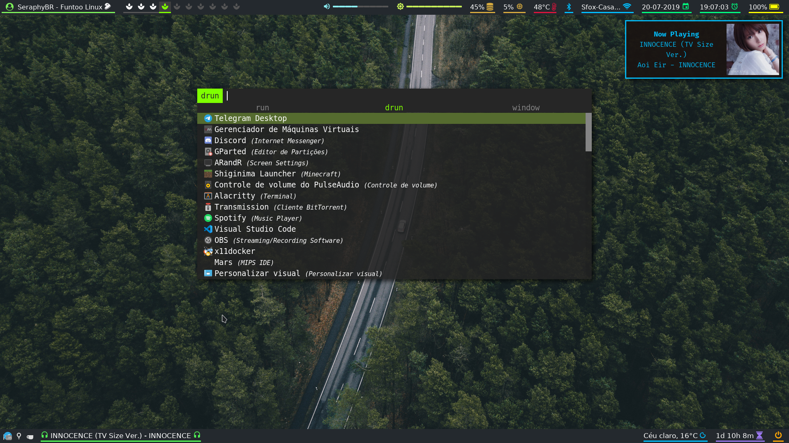
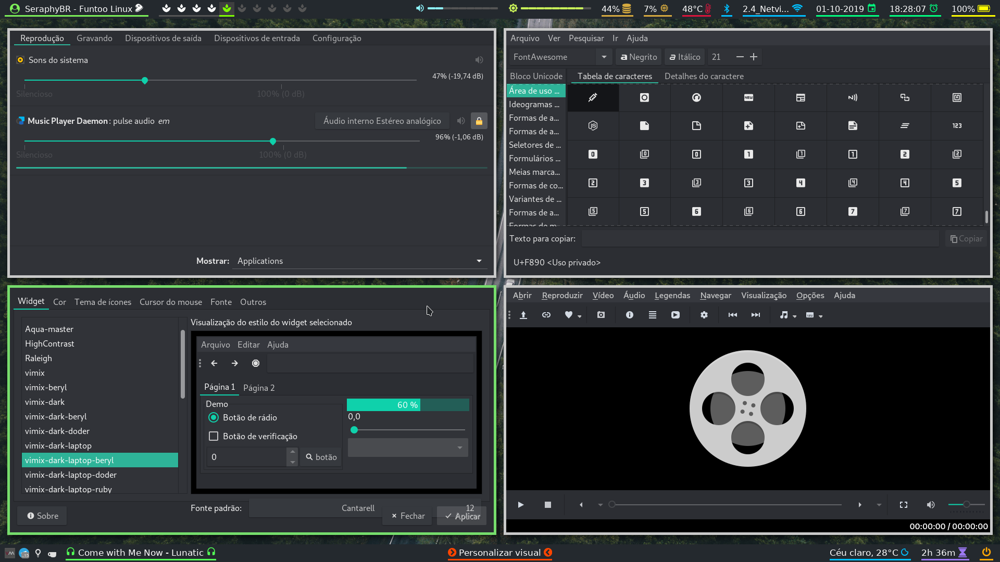
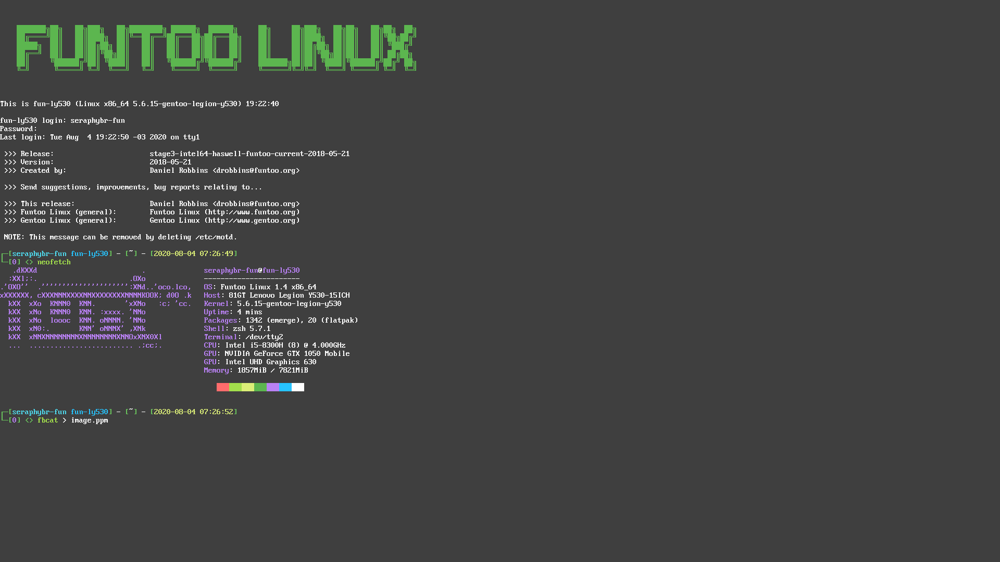

Repository dedicated to my configuration files of my Desktop environment, with the purpose of backup and sharing.

-   [A post on my blog commenting on my dotfiles. (PT-BR)](https://seraphybr.gitlab.io/DotFiles/)

## Screenshots:



### Rofi:



### GTK/QT Look:



### TTY Look:



## Setup Description:

| Type                | Program                                                                                                                             |
| :------------------ | :---------------------------------------------------------------------------------------------------------------------------------- |
| Linux Distro        | [Funtoo](https://www.funtoo.org/Welcome)                                                                                            |
| Session Manager     | [Elogind](https://github.com/elogind/elogind)                                                                                       |
| Window Manager      | [Bspwm](https://github.com/baskerville/bspwm)                                                                                       |
| Web Browser         | [qutebrowser](https://qutebrowser.org/)                                                                                             |
| Program Launcher    | [Rofi](https://github.com/DaveDavenport/rofi)                                                                                       |
| Status bar          | [Polybar](https://github.com/jaagr/polybar)                                                                                         |
| Music Player        | [Ncmpcpp](https://rybczak.net/ncmpcpp/) + [Mpd](https://github.com/MusicPlayerDaemon/MPD)                                           |
| Music Player        | [Spotify](https://www.spotify.com/) (with a polybar module: [spotify_status](https://github.com/Jvanrhijn/polybar-spotify))         |
| Vídeo Player        | [SMPlayer](https://www.smplayer.info/) and [MPV](https://mpv.io/)                                                                   |
| Sound Visualizer    | [Cava](https://github.com/karlstav/cava)                                                                                            |
| File Manager        | [Ranger](https://github.com/ranger/ranger) with [Icons](https://github.com/alexanderjeurissen/ranger_devicons)                      |
| Image Viewer        | [Sxiv](https://github.com/muennich/sxiv) / [ueberzug](https://github.com/seebye/ueberzug) (for preview in Ranger)                   |
| PDF Viewer          | [zathura](https://github.com/pwmt/zathura)                                                                                          |
| Wallpaper Setter    | [hsetroot](https://github.com/himdel/hsetroot) (with [wallblur](https://github.com/SeraphyBR/wallblur) script)                      |
| Screen Shooter      | [Maim + Slop](https://github.com/naelstrof/maim)                                                                                    |
| Terminal Emulator   | [Kitty](https://sw.kovidgoyal.net/kitty/index.html) / [Alacritty](https://github.com/jwilm/alacritty)                               |
| Shell               | Zsh ([Oh-my-zsh](https://github.com/robbyrussell/oh-my-zsh) with [PowerLevel9k](https://github.com/bhilburn/powerlevel9k) theme)    |
| Text Editor         | [Neovim](https://neovim.io/) / [VScode](https://code.visualstudio.com/)                                                             |
| Power Manager       | [TLP](http://linrunner.de/en/tlp/docs/tlp-linux-advanced-power-management.html)                                                     |
| Monitor setup       | Arandr / [xrandr](https://wiki.archlinux.org/index.php/xrandr) / [srandrd](https://github.com/jceb/srandrd) (handle multi monitors) |
| Lock Screen         | [Betterlockscreen](https://github.com/pavanjadhaw/betterlockscreen) (i3lock-color script)                                           |
| Automounter         | [Udiskie](https://github.com/coldfix/udiskie)                                                                                       |
| Notification Daemon | [Dunst](https://github.com/dunst-project/dunst)                                                                                     |
| GTK theme           | [Vimix-dark-laptop-beryl](https://github.com/vinceliuice/vimix-gtk-themes)                                                          |
| Cursor theme        | Breeze Obsidian                                                                                                                     |

#### Main Fonts used in this Dotfiles:

| Font                                                                  | Usage                                                                      |
| :-------------------------------------------------------------------- | :------------------------------------------------------------------------- |
| [Cantarell](https://github.com/GNOME/cantarell-fonts)                 | Gui Programs                                                               |
| [DejavuSans](https://github.com/dejavu-fonts/dejavu-fonts)            | Polybar                                                                    |
| [Fira Code](https://github.com/tonsky/FiraCode)                       | Qutebrowser & Dunst & VScode & Alacritty/Kitty (Nerd Font patched Version) |
| [FontAwesome4](https://github.com/FortAwesome/Font-Awesome/tree/fa-4) | Polybar                                                                    |
| [MaterialDesign](https://github.com/google/material-design-icons)     | Polybar                                                                    |
| [Nerd-fonts](https://github.com/ryanoasis/nerd-fonts)                 | Zsh                                                                        |
| [Noto Sans CJK](https://www.google.com/get/noto/help/cjk/)            | Polybar (support for Asian letters)                                        |
| [Weather-icons](https://erikflowers.github.io/weather-icons/)         | Polybar                                                                    |
| [font-logos](https://github.com/lukas-w/font-logos)                   | Distro logo in Polybar                                                     |

#### Vim/Neovim Plugins:

| Plugin                                                                                      | Usage                                                 |
| :------------------------------------------------------------------------------------------ | :---------------------------------------------------- |
| [ALE](https://github.com/w0rp/ale)                                                          | Linting support                                       |
| [COC](https://github.com/neoclide/coc.nvim)                                                 | Completion support and Language Server client         |
| [NERDTree](https://github.com/scrooloose/nerdtree)                                          | File explorer                                         |
| [Vista](http://liuchengxu.org/vista.vim/)                                                   | Viewer for Symbols and Ctags                          |
| [echodoc](https://github.com/Shougo/echodoc.vim)                                            | Print infos in echo area                              |
| [gentoo-syntax](https://github.com/gentoo/gentoo-syntax)                                    | Support for specific files related to portage         |
| [gruvbox](https://github.com/morhetz/gruvbox)                                               | Color scheme                                          |
| [indentline](https://github.com/Yggdroot/indentLine)                                        | Display the indention levels with thin vertical lines |
| [markdown-preview](https://github.com/iamcco/markdown-preview.vim)                          | Markdown Live Preview                                 |
| [nerdtree-git-plugin](https://github.com/Xuyuanp/nerdtree-git-plugin)                       | Git status support for NERDTree                       |
| [rainbow](https://github.com/luochen1990/rainbow)                                           | Rainbow Parentheses Improved                          |
| [undotree](https://github.com/mbbill/undotree)                                              | Undo history visualizer                               |
| [vim-airline-themes](https://github.com/vim-airline/vim-airline-themes)                     | Themes for vim-airline                                |
| [vim-airline](https://github.com/vim-airline/vim-airline)                                   | Status Line                                           |
| [vim-devicons](https://github.com/ryanoasis/vim-devicons)                                   | Icons for vim plugins                                 |
| [vim-fugitive](https://github.com/tpope/vim-fugitive)                                       | Git wrapper inside Vim                                |
| [vim-nerdtree-syntax-highlight](https://github.com/tiagofumo/vim-nerdtree-syntax-highlight) | Extra syntax and highlight for nerdtree files         |
| [vim-plug](https://github.com/junegunn/vim-plug)                                            | Plugin manager                                        |
| [vim-polyglot](https://github.com/sheerun/vim-polyglot)                                     | For better syntax highlighting                        |
| [vim-startify](https://github.com/mhinz/vim-startify)                                       | Start Screen for Vim                                  |
| [vim-template](https://github.com/aperezdc/vim-template)                                    | Templates                                             |
| [vim-unimpaired](https://github.com/tpope/vim-unimpaired)                                   | Awesome Keybinds                                      |
| [vimtex](https://github.com/lervag/vimtex)                                                  | LaTeX support                                         |

##### Obs: [The extensions](https://github.com/neoclide/coc.nvim/wiki/Using-coc-extensions) I use from COC are defined in the neovim config

#### Rofi Theme:

-   To use my theme for Rofi, download one of the .rasi files from [here](Rofi/Themes) and run the command:

    ```
    sudo cp theme-name.rasi /usr/share/rofi/themes/theme-name.rasi
    ```

-   And then run the `rofi-theme-selector` command to set the theme to be used.

-   Alternatively, just add this to your ~/.config/rofi/config

    ```
    rofi.theme: ~/path/to/theme.rasi
    ```

-   My current theme is based on [flat-orange](https://github.com/DaveDavenport/rofi-themes/blob/master/User%20Themes/flat-orange.rasi).
    I found it in the [rofi-themes](https://github.com/DaveDavenport/rofi-themes/tree/master/User%20Themes) repository,
    in that same place you can get other themes and modify them as I did. For more details on setting up an .rasi file, run the `man rofi-theme` command.

#### Linux TTY Console:

-   In the folder [etc](etc), I have a file called [tty-colors](etc/tty-colors), this is a configuration file containing my color scheme used in the Console.
    This color scheme is loaded at the initialization of openrc by calling the [setcolors](https://github.com/SeraphyBR/linux-vt-setcolors)
    program that will apply colors to all TTY's, overriding the default values.
    I preferred to use this method of [setcolors](https://github.com/SeraphyBR/linux-vt-setcolors) than using echo.

-   To use in funtoo/gentoo openrc:

    ```
    git clone https://github.com/SeraphyBR/linux-vt-setcolors
    cd linux-vt-setcolors
    sudo make install
    ```

-   After installing, copy the file [tty-colors](etc/tty-colors) or use one of the ones that are in the program's
    [example-colors](https://github.com/SeraphyBR/linux-vt-setcolors/tree/master/example-colors) directory, to /etc.

-   And then create the following script called "tty-colors.start" in [/etc/local.d/](https://wiki.gentoo.org/wiki//etc/local.d) :

    ```sh
    #!/bin/sh

    PROGRAM=/usr/local/bin/setcolors
    COLORS=/etc/tty-colors

    if [ -e "$PROGRAM" ] && [ -e $COLORS ]; then
        $PROGRAM $COLORS
    fi

    ```

-   And then run the following commands, as root, to make the file executable, and loaded by OpenRC at boot time:

    ```sh
    chmod +x /etc/local.d/tty-colors.start
    rc-update add local default
    ```

#### Touchpad Support:

-   To use enable touch-click, install libinput and create the following file in "/etc/X11/xorg.conf.d/40-libinput.conf"

    ```
    Section "InputClass"
        Identifier "libinput"
        MatchIsTouchpad "on"
        Option "Tapping" "on"
        Option "TappingButtonMap" "lmr"
        Option "TappingDrag" "on"
        Driver "libinput"
    EndSection
    ```
